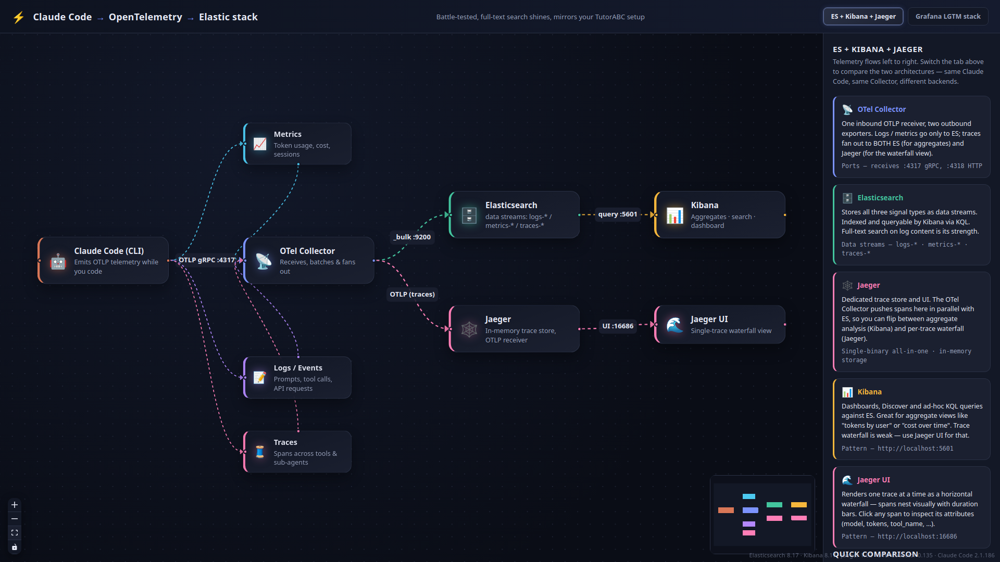
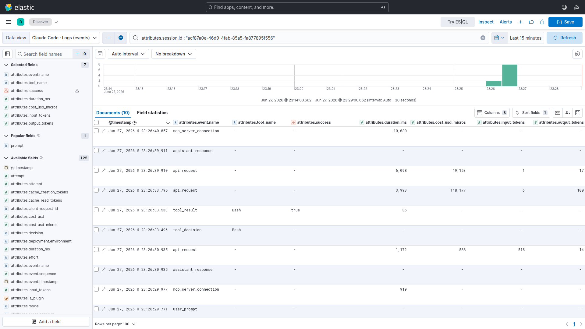
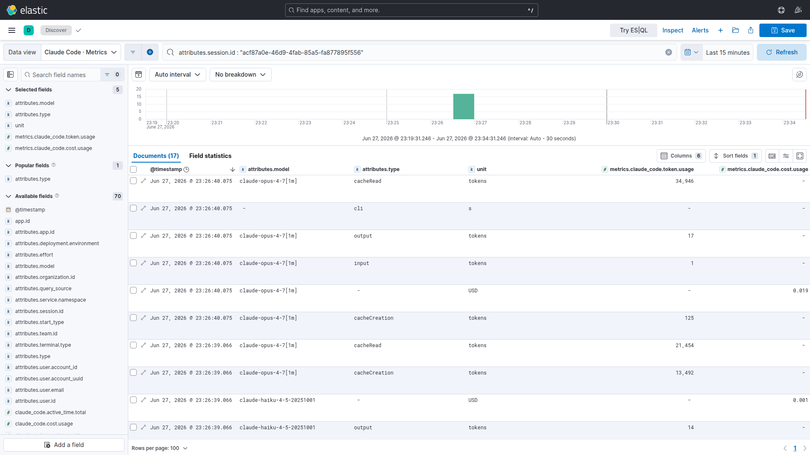
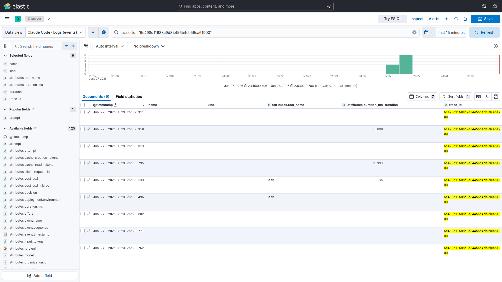
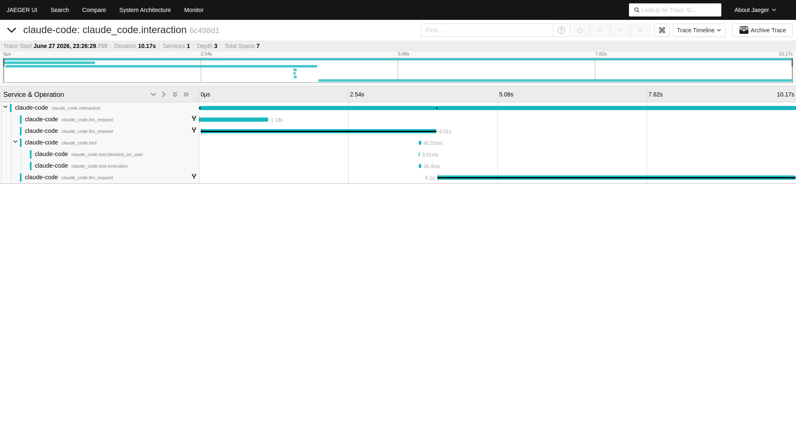
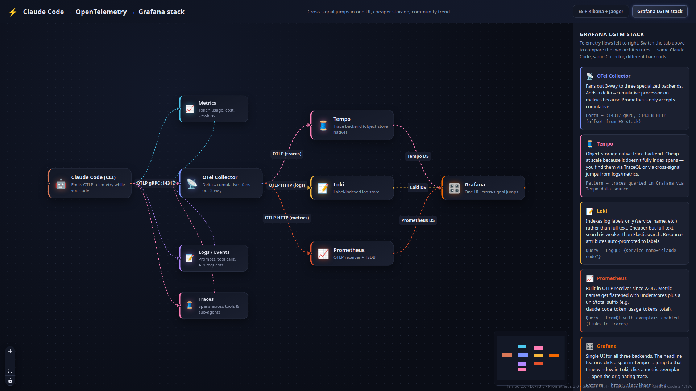
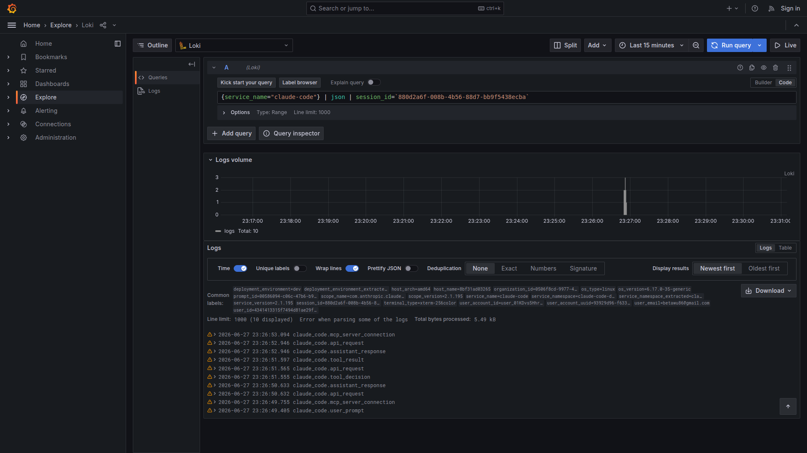
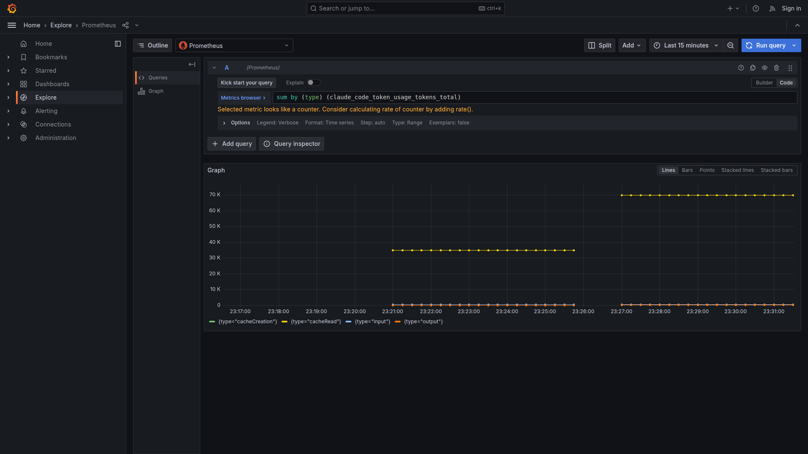
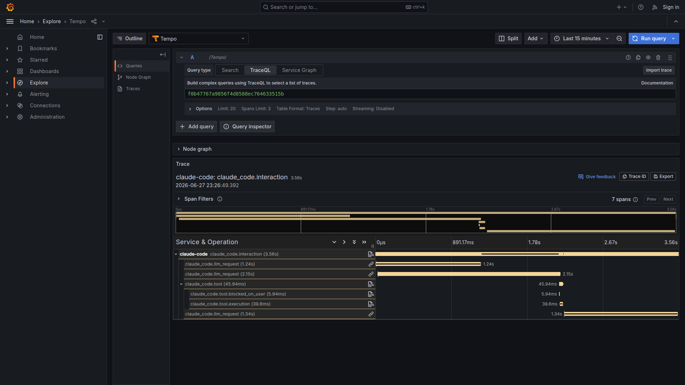

# Claude Code observability — Elastic or Grafana

Pre-wired OpenTelemetry pipeline for Claude Code, with two interchangeable
backends in one repo. Same telemetry, two completely different UI experiences —
pick the one that fits your team:

- **Elasticsearch + Kibana + Jaeger** — battle-tested aggregations, full-text
  log search, Jaeger for trace waterfalls.
- **Grafana LGTM** — Tempo + Loki + Prometheus, single UI, one-click jumps
  between signals.

Both compose files live in this repo on **offset ports** — you can run them
side-by-side and compare.

## Contents

- [Pick a stack](#pick-a-stack)
- [The walkthrough](#the-walkthrough)
- [Path A — Elasticsearch + Kibana + Jaeger](#path-a--elasticsearch--kibana--jaeger)
- [Path B — Grafana LGTM](#path-b--grafana-lgtm)
- [Side-by-side](#side-by-side)
- [Caveats](#caveats)
- [Architecture](#architecture)
- [Reference](#reference)

---

## Pick a stack

| You want… | Stack | Why |
|---|---|---|
| Full-text search, mature aggregations, drop-in beside existing Elastic | **ES + Kibana + Jaeger** | Kibana for aggregates, Jaeger for waterfalls |
| Single UI with one-click jumps between logs / metrics / traces, cheaper at scale | **Grafana LGTM** | Tempo + Loki + Prometheus, correlations pre-wired |
| Both, for side-by-side comparison | Run both | Ports are offset, no conflict |

---

## The walkthrough

Everything below comes from running the **same prompt** against each stack:

```bash
claude -p 'Run the bash command "echo hello-from-readme" and confirm what it printed.'
```

That single prompt produces:

- **10 events** — `user_prompt` → `api_request` → `tool_decision` → `tool_result` → `api_request` → `assistant_response`
- **7 spans** in one trace — `claude_code.interaction` → 3× `claude_code.llm_request` + `claude_code.tool` → `tool.blocked_on_user` + `tool.execution`
- Token-usage metric samples per model / type and a USD cost sample

Each path below shows what those signals look like in its UI.

---

## Path A — Elasticsearch + Kibana + Jaeger



### Run it

```bash
docker compose up -d            # ~1 min on first boot
source claude-code.env          # → OTLP to localhost:4317
claude -p 'Run the bash command "echo hello-from-readme" and confirm what it printed.'
```

A one-shot `kibana-setup` container registers the traces template,
`claude-code-attributes@mappings` (typed numeric / boolean / flattened columns),
the JSON-parse ingest pipeline, and imports the dashboard. Without it,
`tool_input.command` queries return zero and `sum(duration_ms)` errors —
see [`CLAUDE.md`](CLAUDE.md) facts 5a–5c for the gory details.

### Logs in Kibana Discover



10 events, all from one session. `success` renders as a real boolean,
`duration_ms` / `cost_usd_micros` / `input_tokens` / `output_tokens` as real
numbers — sum and avg in Lens just work, no scripted-field workarounds needed.

### Metrics in Kibana Discover



Token usage broken down by `attributes.model` × `attributes.type`
(input / output / cacheRead / cacheCreation), in the same documents as the USD
cost samples. Each row is a `(metric, dimensions, value)` tuple ready for
Lens visualizations.

### Traces — Kibana for query, Jaeger for waterfall



The 9 spans of the prompt trace, listed in Discover with `name`, `kind`,
`attributes.tool_name`, and rendered `duration`. Good for "find all traces
where the tool took >1s"-style aggregation queries.



The same trace in Jaeger — 10.17 s wall-clock, two `llm_request` spans run in
parallel and dominate; the actual Bash tool execution is ~30 ms in the middle.
Click any span to inspect its attributes (model, tokens, tool_name, ...).

---

## Path B — Grafana LGTM



### Run it

```bash
cd grafana-stack
docker compose up -d
source claude-code-grafana.env  # → OTLP to localhost:14317 (offset from ES stack)
claude -p 'Run the bash command "echo hello-from-readme" and confirm what it printed.'
```

The Grafana collector includes a `deltatocumulative` processor on the metrics
pipeline because Prometheus's OTLP receiver rejects Claude Code's native DELTA
metrics — see [`grafana-stack/README.md`](grafana-stack/README.md) for the
full processor + datasource wiring.

### Logs in Loki



Same 10 events, queried by LogQL with the JSON parser:
`{service_name="claude-code"} | json | session_id="..."`. *Common labels* at
the top are resource attributes Loki auto-promoted — `service_name`,
`user_email`, `session_id`, `prompt_id` — making label-based filtering free.
Per-event details (`tool_name`, `success`, ...) come through as structured
metadata, queryable but not promoted.

### Metrics in Prometheus



Token usage by type. Note the OTel-to-Prom name mangling:
`claude_code.token.usage` (tokens) → `claude_code_token_usage_tokens_total`
(dots to underscores, unit + `_total` suffix appended). Same data shape as
Kibana metrics, just a different query language.

### Traces in Tempo



Same span tree in Tempo. Notice the small **log icon** next to every span —
one click and Grafana opens a Loki split view with a query scoped to that
span's time window and trace ID. This trace → log → metric correlation,
pre-wired in provisioning, is the Grafana stack's signature feature.

---

## Side-by-side

| Signal | ES stack | Grafana stack |
|---|---|---|
| **Logs** | Kibana Discover, KQL, full-text search across log content | Loki, LogQL, label-indexed — record attributes as structured metadata |
| **Metrics** | Discover or Lens panels over `metrics-claude_code.otel-default` | Prometheus, names flattened (`*_tokens_total`), native PromQL |
| **Traces** | Discover for spans + queries, Jaeger as a **separate** waterfall UI | Tempo waterfall directly in Grafana, one-click split-view to Loki |
| **Cross-signal** | Manual — copy `trace_id` to Jaeger, copy `session.id` into Discover | Pre-wired deep links between datasources |
| **Strength** | Full-text grep, mature aggregations, drops in next to existing Elastic | Single UI, cheaper object-store backend, cross-signal navigation |
| **Trade-off** | Two UIs (Kibana + Jaeger), Lucene-shaped query languages | Loki full-text is label-bounded, Prometheus rejects DELTA without the processor |

Both consume the **same** OTLP from Claude Code — only the env file
(`claude-code.env` vs `grafana-stack/claude-code-grafana.env`) and the
receiver port change.

---

## Caveats

- **Demo, not production.** Single-node Elasticsearch with `xpack.security`
  off, no TLS, in-memory Jaeger. For team rollout (auth, multi-tenancy, ILM,
  MDM-managed env) see
  [`docs/admin-rollout-guide.md`](docs/admin-rollout-guide.md).
- **Privacy.** `claude-code.env` opts into `OTEL_LOG_USER_PROMPTS=1` and
  `OTEL_LOG_TOOL_DETAILS=1` — prompts, tool commands, and tool args are
  captured verbatim. Comment those two lines out if your policy says no.
- **Teardown.** `docker compose down -v` (the `-v` also drops the ES volume).
- **Old Elasticsearch?** 8.14 ships partial OTel templates, 8.16+ ships them
  all; 8.17 is the recommended target. Runbook:
  [`docs/es-upgrade-8.14-to-8.17.md`](docs/es-upgrade-8.14-to-8.17.md).

---

## Architecture

```
                                                ┌─▶ Elasticsearch ──▶ Kibana
 Claude Code ──OTLP/gRPC :4317──▶ OTel Collector │      :9200             :5601
                                                └─▶ Jaeger ──▶ Jaeger UI :16686

                                                  ┌─▶ Tempo       (traces)
 Claude Code ──OTLP/gRPC :14317──▶ OTel Collector ─┼─▶ Loki        (logs)
                                                  └─▶ Prometheus  (metrics)  → Grafana :13000
```

The collector upserts `data_stream.dataset=claude_code` on resource **and**
record attributes for all three pipelines, so every signal lands in
`*-claude_code.otel-*` regardless of which event Claude Code natively brands.
See [`CLAUDE.md`](CLAUDE.md) for the rest of the hard-won facts (broken
collector versions, Loki label promotion, Prometheus DELTA/CUMULATIVE, etc.).

## Reference

- [`docs/signals-reference.md`](docs/signals-reference.md) — every event,
  metric, span, and attribute Claude Code emits, verified against live data.
- [`docs/admin-rollout-guide.md`](docs/admin-rollout-guide.md) — taking this
  from demo to a team plan.
- [`docs/es-upgrade-8.14-to-8.17.md`](docs/es-upgrade-8.14-to-8.17.md) —
  upgrading older Elasticsearch.
- `observability-explainer/` — React Flow app that renders the two
  architecture diagrams interactively (already started by
  `docker compose up`, at http://localhost:5173).
